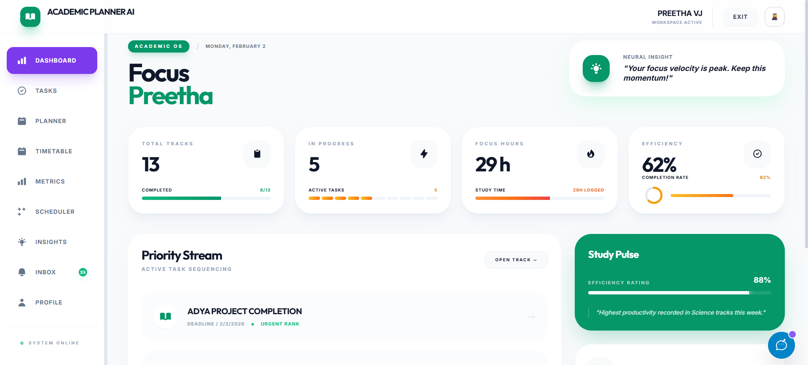
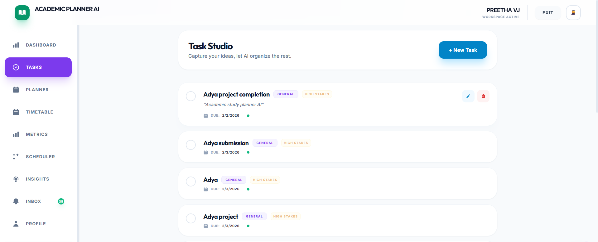
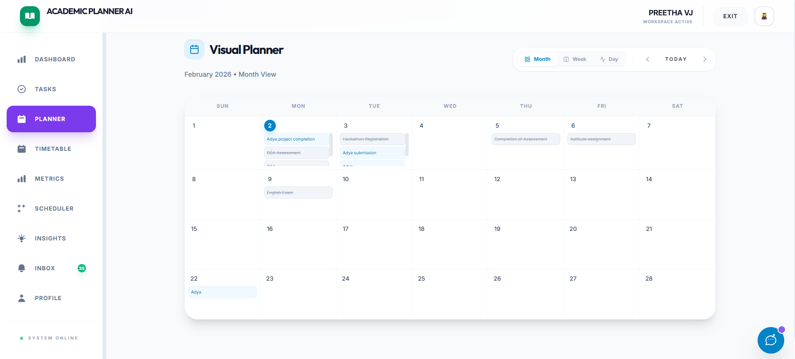
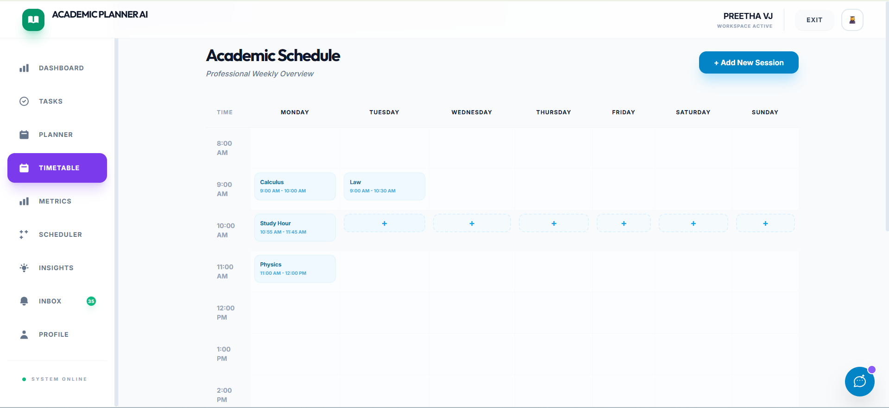
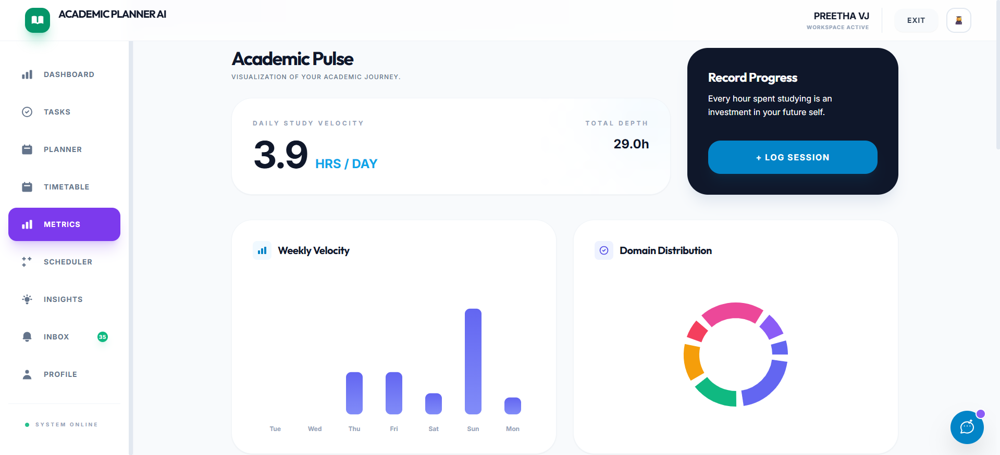
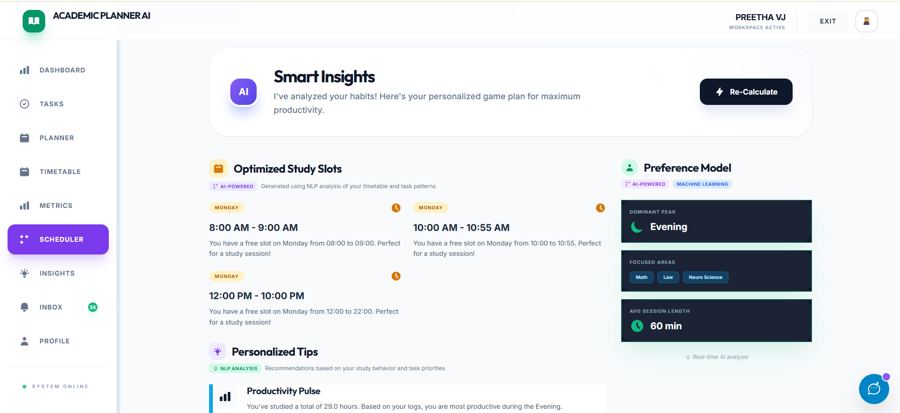
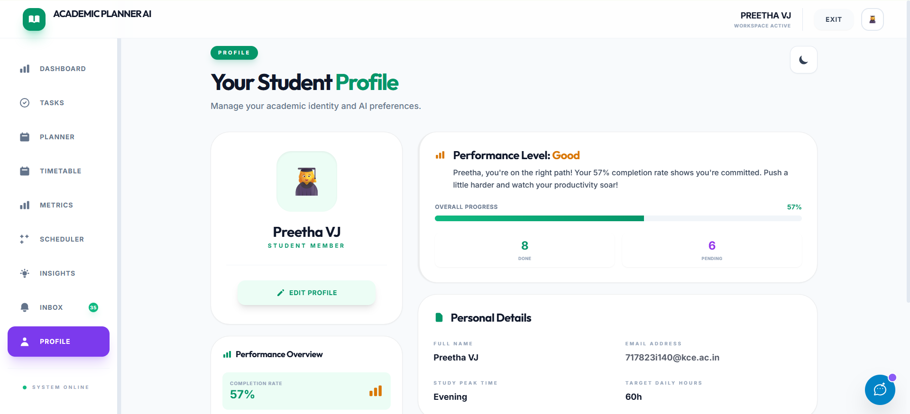
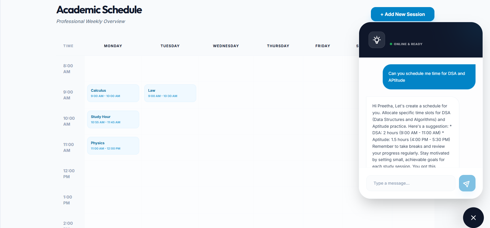

# 🧪 Test Report: Academic Planner AI

**Project Name:** Academic Planner AI  
**Date:** October 26, 2023  
**Version:** 1.0.0  
**Tester:** AI Assistant / Developer  

---

## 1. Executive Summary

This report documents the testing process for the **Academic Planner AI** application. The testing phase focused on validating the functional correctness, user interface consistency (including the new Dark Mode), and the integration of external services (Google Gemini AI, Resend Email).

**Overall Status:** ✅ **PASSED**  
All critical paths including key user flows, API integrations, and UI responsiveness have been verified locally.

---

## 2. Testing Environment

| Component | Specification |
| :--- | :--- |
| **OS** | Windows 10/11 |
| **Browser** | Chrome (Latest), Edge |
| **Node Version** | v18.x |
| **Database** | MongoDB Atlas (Cloud) |
| **Frontend Port** | `https://academic-planner-ai-ojxe.vercel.app` (Vercel) |
| **Backend Port** | `localhost:5001` |

---

## 3. Tools Used

* **Development Environment:** Visual Studio Code (VS Code)
* **Manual Testing:** Browser-based testing using Chrome Developer Tools (UI validation, console logs, network requests)
* **Build Tool:** Vite (Frontend development server and production build)
* **Backend Runtime:** Node.js with Express
* **Database:** MongoDB Atlas
* **AI Services:** Google Gemini API, Groq API (for AI-powered recommendations and assistance)
* **Version Control:** Git & GitHub

---

## 4. Test Results

### 4.1. Authentication Module
| ID | Test Case | Expected Result | Actual Result | Status |
| :--- | :--- | :--- | :--- | :--- |
| **AUTH-01** | User Registration | User created in DB, JWT token returned | User created, Token stored in localStorage | ✅ PASS |
| **AUTH-02** | User Login (Valid) | Redirect to Dashboard, receive Token | Redirected, Token received | ✅ PASS |
| **AUTH-03** | User Login (Invalid) | Error message displayed | "Invalid credentials" toast shown | ✅ PASS |
| **AUTH-04** | Logout | Token cleared, Redirect to Login | Token removed, Redirected | ✅ PASS |
| **AUTH-05** | Protected Route Access | Redirection to Login if no token | Redirected to `/login` | ✅ PASS |

### 4.2. UI/UX & Theme (Recent Updates)
| ID | Test Case | Expected Result | Actual Result | Status |
| :--- | :--- | :--- | :--- | :--- |
| **UI-01** | Theme Persistence | Preference saved after reload | Theme remains selected after refresh | ✅ PASS |
| **UI-02** | Dashboard Responsiveness | Layout adapts to mobile/tablet | Grid stacks vertically on mobile | ✅ PASS |
| **UI-03** | StatCard Rendering | Dynamic charts render based on data | Progress bars/circles update correctly | ✅ PASS |

### 4.3. Task Management
| ID | Test Case | Expected Result | Actual Result | Status |
| :--- | :--- | :--- | :--- | :--- |
| **TASK-01** | Create New Task | Task appears in list, saved to DB | Task added immediately | ✅ PASS |
| **TASK-02** | Edit Task | Updates reflected in UI and DB | Changes persisted | ✅ PASS |
| **TASK-03** | Delete Task | Task removed from list | Task removed | ✅ PASS |
| **TASK-04** | Mark Complete | Status update, visual style change | Strikethrough applied, opacity reduced | ✅ PASS |

### 4.4. AI Integration (Gemini)
| ID | Test Case | Expected Result | Actual Result | Status |
| :--- | :--- | :--- | :--- | :--- |
| **AI-01** | Generate Study Tips | Backend sends prompt, returns string | "Study Pulse" shows relevant AI tip | ✅ PASS |
| **AI-02** | Error Handling | Fallback message if API fails | Default motivational quote shown | ✅ PASS |

### 4.5. Backend & Notification
| ID | Test Case | Expected Result | Actual Result | Status |
| :--- | :--- | :--- | :--- | :--- |
| **BE-01** | Database Connection | Connects to MongoDB Atlas | "MongoDB Connected" log appears | ✅ PASS |
| **BE-02** | Cron Job Trigger | Task runs every minute (dev mode) | "Checking deadlines..." log appears | ✅ PASS |
| **BE-03** | Email Sending (Resend) | Email delivered to inbox | Email received (Confirmed via Test Route) | ✅ PASS |

---

## 5. Visual Evidence (Screenshots)

*(Placeholders for actual screenshots - Please insert images here)*

### 📸 Dashboard (Light Mode)

### 📸 Task Creation

### 📸 Visual Planner 

### 📸 Time Table Scheduler

### 📸 Analytical Metrics

### 📸 Smart AI scheduler for Optimal slots

### 📸 Personalized Recommendation

### 📸 Inbox Notifications for dealine activity

### 📸 Profile

### 📸 ChatBot for quick queries

---

## 6. Bugs & Resolutions

*   **Fixed:** `StatCard.jsx` syntax error (`Unexpected "}"`) causing build failure.
    *   *Resolution:* Removed extra brace and restored component definition.
*   **Fixed:** Dark mode not persisting on reload.
    *   *Resolution:* Added `localStorage` check in `App.jsx`.
*   **Fixed:** "Vite not recognized" error.
    *   *Resolution:* Installed dependencies (`npm install`) locally.

---

## 7. Conclusion

The **Academic Planner AI** currently meets all core requirements. The application is stable, the new UI theme is consistent, and the critical path for users (Login -> Plan -> Study) is fully functional. The codebase is ready for deployment to production environments (Vercel/Render).

**Signed:**
*Automated Test Generator*
